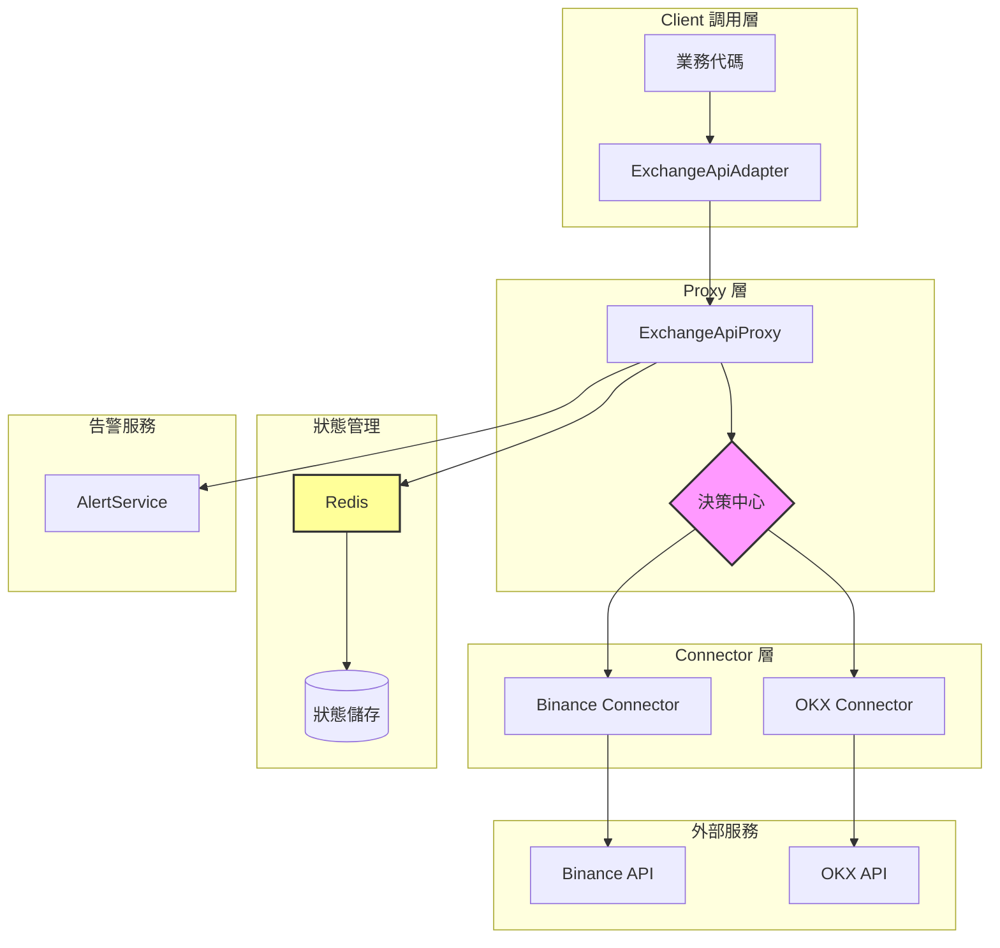
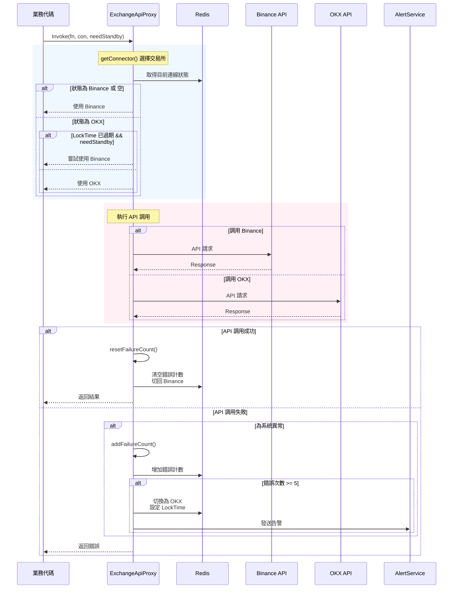
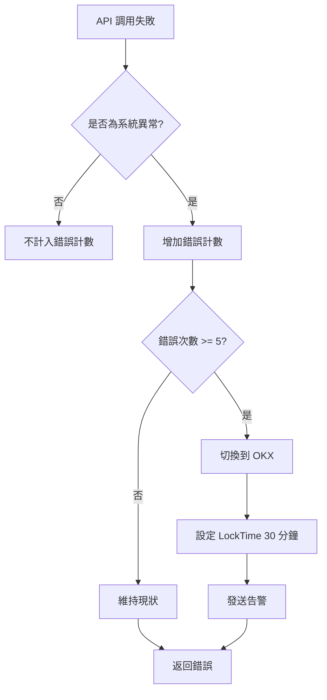
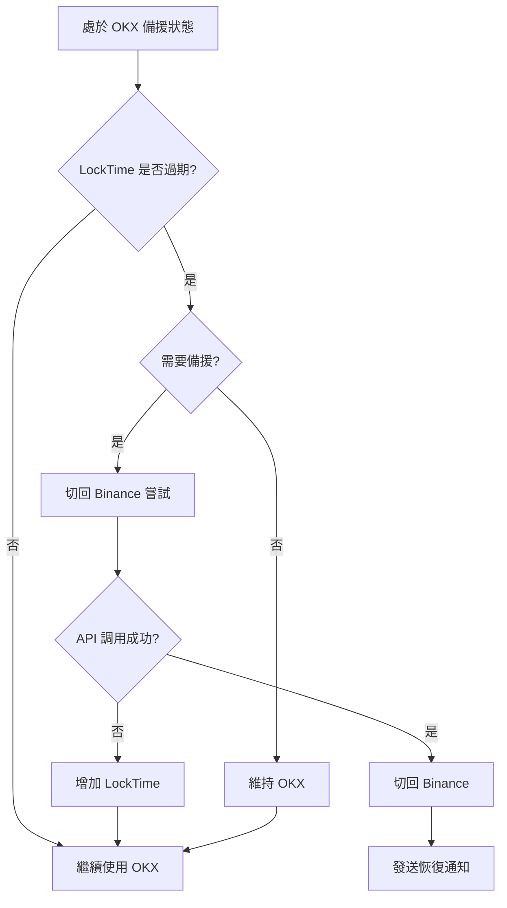

# Exchange Proxy 設計文件

## 目錄
1. [設計理念](#1-設計理念)
2. [架構圖](#2-架構圖)
3. [核心元件](#3-核心元件)
4. [Interface 說明](#4-interface-說明)
5. [使用方式](#5-使用方式)
6. [備援機制](#6-備援機制)
7. [Redis Key 設計](#7-redis-key-設計)

---

## 1. 設計理念

### 1.1 問題背景
交易所系統依賴外部交易所 API（如 Binance、OKX）進行報價、交易等操作。當主要交易所（如 Binance）發生異常時，系統需要自動切換到備援交易所（OKX），以確保服務不中斷。

### 1.2 設計目標
- **高可用性**：主交易所異常時自動切換到備援交易所
- **自動恢復**：主交易所恢復後，自動切回主交易所
- **狀態持久化**：使用 Redis 儲存切換狀態，支援多實例部署
- **靈活性**：可根據 API 類型決定是否需要備援機制

### 1.3 核心概念
- **主交易所**：預設使用的交易所（Binance）
- **備援交易所**：當主交易所異常時，切換到的交易所（OKX）
- **失敗閾值**：觸發切換的連續錯誤次數
- **LockTime**：切換後的鎖定時間，防止頻繁切換

---

## 2. 架構圖



### 流程圖



---

## 3. 核心元件

### 3.1 檔案結構

```
internal/third_party/
├── exchange.go              # 核心 Interface 定義
├── exchange_proxy.go       # 備援 Proxy 實現
├── exchange_api_adapter.go # API 適配器
├── binance.go              # Binance API 實現
└── okx.go                  # OKX API 實現
```

### 3.2 常數定義

```go
// Redis Key
const ExchangeConnectorKey = "exchange:connector"           // 目前使用的交易所
const ExchangeConnectorLockTime = "exchange:lockTime"      // 鎖定時間
const ExchangeConnectorErrTimeAt = "exchange:errTime"       // 錯誤時間戳記

// 閾值
const ExchangeConnectorErrThreshold = 5   // 錯誤次數閾值
const ExchangeConnectorErrTTL = 30秒      // 錯誤計數有效期
const ExchangeConnectorLockTimeTTL = 30分鐘 // LockTime 有效期
```

---

## 4. Interface 說明

### 4.1 ExchangeConnector

**位置**：`internal/third_party/exchange.go:32`

**說明**：交易所連接器的抽象介面，定義交易所 API 的操作方法。

```go
type ExchangeConnector interface {
    // 判斷是否為系統異常
    IsSystemAbnormal(FailureCode string) bool

    // ===== K線數據 =====
    Klines(symbol entity.SymbolPair, interval entity.Interval, limit uint64) (res ExchangeApiResponse, err error)
    ClosingTimeRemaining(interval entity.Interval) (res ExchangeApiResponse, err error)
    GetPriceHistoryIntervalLimit(intervalLetter entity.IntervalLetter) (res ExchangeApiResponse, err error)

    // ===== 合約交易 =====
    FutureTrade(input entity.BuySellTrade) (res ExchangeApiResponse, err error)
    GetUSDTMFuturesPrecision(base entity.Token2) (res ExchangeApiResponse, err error)
    FuturesExchangeInfo(symbol string) (res ExchangeApiResponse, err error)
    GetFuturesBills(startTime int64) (res ExchangeApiResponse, err error)

    // ===== 合約帳戶 =====
    FuturesTransfer(symbol string, amount string, transferType entity.BinanceInternalTransferType) (res ExchangeApiResponse, err error)
    FuturesAccount() (res ExchangeApiResponse, err error)
    FuturesAccountPositionRisk(symbol string) (res ExchangeApiResponse, err error)

    // =====現貨交易 =====
    SpotTrade(input entity.BinanceSpotTrade) (res ExchangeApiResponse, err error)
    SpotAllOrders(input *entity.ReqBinanceAllOrders) (res ExchangeApiResponse, err error)
    SpotAccountTradeList(input *entity.ReqBinanceAccountTradeList) (res ExchangeApiResponse, err error)
    PerpAccountTradeList(input *entity.ReqBinanceAccountTradeList) (res ExchangeApiResponse, err error)
    GetCommission(input *entity.ReqExchangeCommissioneList) (res ExchangeApiResponse, err error)
    SpotAccountInternalTransferRecord(input *entity.ReqBinanceAccountInternalTransferRecord) (res ExchangeApiResponse, err error)
    SpotWithdraw(symbol, amount, to, network string, toSource entity.TransferRecordVendor) (res ExchangeApiResponse, err error)
    SpotWithdrawRecord(input *entity.ReqBinanceWithdrawRecord) (res ExchangeApiResponse, err error)

    // ===== 現貨帳戶 =====
    CapitalCoinGetAll() (res ExchangeApiResponse, err error)
    SpotAssets(symbol string) (res ExchangeApiResponse, err error)
    NewestQuoteTicker(pair entity.SymbolPair) (res ExchangeApiResponse, err error)
    GetSpotPrecision(base entity.Token2) (res ExchangeApiResponse, err error)
    SymbolPriceTicker() (res ExchangeApiResponse, err error)
}
```

**方法分類**：
| 分類 | 方法 | 說明 |
|------|------|------|
| K線數據 | `Klines`, `ClosingTimeRemaining`, `GetPriceHistoryIntervalLimit` | 取得 K 線與時間相關數據 |
| 合約交易 | `FutureTrade`, `GetUSDTMFuturesPrecision`, `FuturesExchangeInfo` | 期貨合約交易 |
| 合約帳戶 | `FuturesTransfer`, `FuturesAccount`, `FuturesAccountPositionRisk` | 期貨帳戶操作 |
| 現貨交易 | `SpotTrade`, `SpotAllOrders`, `SpotAccountTradeList` | 現貨交易 |
| 現貨帳戶 | `CapitalCoinGetAll`, `SpotAssets`, `NewestQuoteTicker` | 現貨帳戶與報價 |

---

### 4.2 ExchangeConnectorType

**位置**：`internal/third_party/exchange.go:14`

**說明**：交易所類型枚舉。

```go
type ExchangeConnectorType string

const (
    ExchangeConnectorTypeBinance ExchangeConnectorType = "Binance"
    ExchangeConnectorTypeOKX     ExchangeConnectorType = "OKX"
)
```

---

### 4.3 ExchangeApiResponse

**位置**：`internal/third_party/exchange.go:25`

**說明**：API 調用的統一回應格式。

```go
type ExchangeApiResponse struct {
    IsSuccess     bool                   // 調用是否成功
    Body          []byte                 // 回應 body
    FailureCode   string                 // 失敗錯誤碼
    ConnectorType ExchangeConnectorType  // 實際使用的交易所類型
}
```

---

### 4.4 ExchangeApiProxy

**位置**：`internal/third_party/exchange.go:9`

**說明**：交易所 API Proxy 介面，負責備援機制的核心邏輯。

```go
type ExchangeApiProxy interface {
    // 執行 API 調用，自動處理備援
    // fn: 實際的 API 調用函數
    // con: 指定的交易所類型（可為 nil）
    // needStandbyConnector: 是否需要備援機制
    Invoke(fn func(ct ExchangeConnectorType, connector ExchangeConnector) (ExchangeApiResponse, error), 
           con *ExchangeConnectorType, 
           needStandbyConnector bool) (ExchangeApiResponse, error)
    
    // 取得目前連線的交易所類型
    NowConnect() string
}
```

---

### 4.5 ExchangeApi

**位置**：`internal/third_party/exchange.go:65`

**說明**：面向業務代碼的高層 API 介面，回傳經過解析的業務數據。

```go
type ExchangeApi interface {
    NowConnect() string
    
    // K線數據
    Klines(symbol entity.SymbolPair, interval entity.Interval, limit uint64) (klines []entity.Kline, err error)
    ClosingTimeRemaining(interval entity.Interval) time.Duration
    GetPriceHistoryIntervalLimit(intervalLetter entity.IntervalLetter) (interval entity.Interval, limit uint64)
    
    // 合約交易
    FutureTrade(input entity.BuySellTrade) (output entity.BuySell error)
    GetTradeRecord, errUSDTMFuturesPrecision(base entity.Token2) (pricePrecision, quantityPrecision int32)
    FuturesExchangeInfo(symbol string) (resp entity.BinanceExchangeInfo, err error)
    GetFuturesBills(startTime int64) (resp []entity.ExchangeFuturesBillsItem, err error)
    
    // 合約帳戶
    FuturesTransfer(symbol string, amount string, transferType entity.BinanceInternalTransferType, connector ExchangeConnectorType) (err error)
    FuturesAccount() (account entity.BinanceFuturesAccount, err error)
    FuturesAccountPositionRisk(symbol string) (risk []entity.BinanceFuturesPositionRisk, err error)
    
    // 現貨交易
    SpotTrade(input entity.BinanceSpotTrade) (output entity.BinanceSpotTradeRecord, err error)
    SpotAllOrders(input *entity.ReqBinanceAllOrders) (output []entity.BinanceAllOrders, err error)
    SpotAccountTradeList(input *entity.ReqBinanceAccountTradeList) (output []entity.BinanceAccountTradeList, err error)
    PerpAccountTradeList(input *entity.ReqBinanceAccountTradeList) (output []entity.BinancePerpAccountTradeList, err error)
    GetCommission(input *entity.ReqExchangeCommissioneList) (output []entity.ExchangeCommissionList, err error)
    SpotAccountInternalTransferRecord(input *entity.ReqBinanceAccountInternalTransferRecord) (output []entity.BinanceAccountInternalTransferRecord, err error)
    SpotWithdraw(symbol, amount, to, network string, toSource entity.TransferRecordVendor) (id string, err error)
    SpotWithdrawRecord(input *entity.ReqBinanceWithdrawRecord) (output []entity.BinanceWithdrawRecord, err error)
    
    // 現貨帳戶
    CapitalCoinGetAll() (coinConfigs []entity.BinanceCoinConfigWithNetworkList, err error)
    SpotAssets(symbol string) (spotAssets []entity.BinanceSpotAsset, err error)
    NewestQuoteTicker(pair entity.SymbolPair) (price entity.Decimal, err error)
    GetSpotPrecision(base entity.Token2) (pricePrecision int32, quantityPrecision int32, quoteQuantityPrecision int32)
    SymbolPriceTicker() (price []entity.BinanceSymbolPrice, err error)
}
```

**與 ExchangeConnector 的差異**：
- `ExchangeConnector`：回傳 `ExchangeApiResponse`，包含原始資料與狀態
- `ExchangeApi`：回傳業務層可使用的結構體，進行了 JSON 解析

---

### 4.6 ExchangeApiAdapter

**位置**：`internal/third_party/exchange_api_adapter.go:10`

**說明**：將 `ExchangeApiProxy` 轉換為 `ExchangeApi` 的適配器。

```go
type ExchangeApiAdapter struct {
    ApiProxy ExchangeApiProxy
}
```

**職責**：
1. 封裝 `ExchangeApiProxy.Invoke()` 調用
2. 解析 `ExchangeApiResponse.Body` 為業務實體
3. 根據 API 類型決定 `needStandbyConnector` 參數

---

### 4.7 ExchangeApiProxyImpl

**位置**：`internal/third_party/exchange_proxy.go:22`

**說明**：`ExchangeApiProxy` 的實現類，實現完整的備援邏輯。

```go
type ExchangeApiProxyImpl struct {
    BinanceImpl  ExchangeConnector  // Binance 連接器
    OKXImpl      ExchangeConnector  // OKX 連接器
    Cache        redis.UniversalClient  // Redis 客戶端
    AlertService IAlertService      // 告警服務
}
```

---

## 5. 使用方式

### 5.1 基本使用

業務代碼透過 `ExchangeApi` 介面調用交易所 API：

```go
// 注入 ExchangeApi
type YourService struct {
    ExchangeApi thirdParty.ExchangeApi
}

func (s *YourService) GetPrice(symbol string) {
    // 調用報價 API
    price, err := s.ExchangeApi.NewestQuoteTicker("BTCUSDT")
}
```

### 5.2 直接使用 Proxy

若需要更細粒度控制，可直接Proxy`：

```使用 `ExchangeApigo
proxy.Invoke(
    func(ct ExchangeConnectorType, connector ExchangeConnector) (ExchangeApiResponse, error) {
        return connector.NewestQuoteTicker("BTCUSDT")
    },
    nil,           // 不指定交易所，自動選擇
    true,          // 需要備援機制
)
```

### 5.3 強制指定交易所

某些 API 只能使用特定交易所：

```go
// 現貨提現只能使用 Binance
binanceCon := ExchangeConnectorTypeBinance
proxy.Invoke(
    func(ct ExchangeConnectorType, connector ExchangeConnector) (ExchangeApiResponse, error) {
        return connector.SpotWithdraw(symbol, amount, to, network, toSource)
    },
    &binanceCon,  // 強制使用 Binance
    false,        // 不需要備援
)
```

### 5.4 needStandbyConnector 參數說明

| 參數值 | 說明 |
|--------|------|
| `true` | 當主要交易所異常時，切換到備援交易所（適用於交易類 API） |
| `false` | 不使用備援，永遠使用主要交易所（適用於只支援單一交易所的 API） |

---

## 6. 備援機制

### 6.1 觸發條件

```
30 秒內發生 5 次系統異常 → 切換到 OKX
```

### 6.2 切換流程



### 6.3 恢復流程



---

## 7. Redis Key 設計

### 7.1 Key 說明

| Key | 類型 | TTL | 說明 |
|-----|------|-----|------|
| `exchange:connector` | String | 無限期 | 目前使用的交易所 (`Binance` 或 `OKX`) |
| `exchange:lockTime` | String | 30 分鐘 | 切換後的鎖定時間，過期後可嘗試切回主交易所 |
| `exchange:errTime:{connector}:{timestamp}` | String | 30 秒 | 錯誤時間戳記，用於計算錯誤次數 |

### 7.2 狀態機

```
┌─────────────────────────────────────────────────────────────┐
│                      exchange:connector                      │
├─────────────────────────────────────────────────────────────┤
│                                                              │
│   ┌──────────┐                              ┌──────────┐     │
│   │ Binance  │ ◄────── 5 次錯誤 ────────── │   OKX    │     │
│   │  (主)    │                              │ (備援)   │     │
│   └────┬─────┘                              └────┬─────┘     │
│        │                                          │          │
│        │ LockTime 過期                            │          │
│        │ + API 成功                               │          │
│        ▼                                          ▼          │
│   [正常] ◄─────────────────────────────────► [LockTime]      │
│                                                              │
└─────────────────────────────────────────────────────────────┘
```

---

## 8. 監控與告警

### 8.1 告警時機

1. **切換到備援**：當從 Binance 切換到 OKX 時
2. **恢復正常**：當從 OKX 切回 Binance 時

### 8.2 告警訊息

```go
// 切換到備援
"因 幣安 發生異常無法使用，先採用 OKX 進行避險、報價的執行。請通知第三方廠商做緊急處理。"

// 恢復正常
"幣安 服務已恢復，已切回正常模式。"
```

---

## 9. 測試

### 9.1 單元測試

```bash
# 執行 exchange proxy 相關測試
go test -v ./internal/third_party/ -run TestExchangeProxy
```

### 9.2 整合測試

```bash
# 執行所有測試
make test
```
